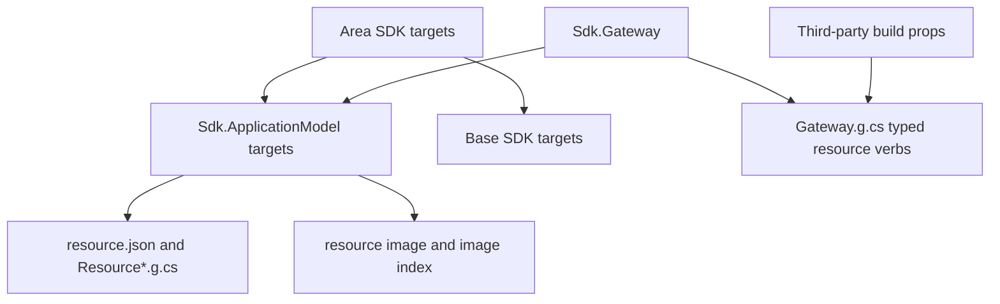

# Assimalign.Cohesion.Sdk.ApplicationModel Design

## Design intent

This SDK owns the build-time application model: resource defaults, manifest and
source generation, resource-reference lifting, certificate validation, image
production, image indexes, and the container-build extension hook. It is an
auxiliary SDK imported by an area SDK after the consumer project body has chosen
whether orchestration is enabled.

The build-time dependency and output flow is:



Area SDKs import the ApplicationModel targets before the base targets. Gateway
always takes the same path. Third-party package rows join the first-party typed
kind rows during normal NuGet props evaluation.

## Package and file boundary

The package contains:

- `Sdk/Sdk.props`, intentionally empty because the enable switch is written in
  the consumer project body and is not final during props evaluation;
- `Sdk/Sdk.targets`, which marks the import and establishes pre-.NET-target
  defaults;
- `Targets/Sdk.Resource.props` and `Sdk.Resource.targets`;
- `Targets/Sdk.Resource.Paths.targets`, evaluated after the .NET targets establish
  target-framework- and RID-specific intermediate paths;
- `Targets/Sdk.Image.targets`;
- `Targets/Assimalign.Cohesion.Sdk.ResourceManifest.props` and
  `RESOURCE_MANIFEST_README.md`;
- `Targets/Assimalign.Cohesion.Sdk.ApplicationModel.Build.targets`, the reserved
  aggregation point; and
- `Assimalign.Cohesion.Sdk.ApplicationModel.Tasks.dll`, containing the resource,
  manifest, certificate, and image tasks.

Strongly typed settings and pin validation remain in the base task assembly.

## MSBuild evaluation order

`CohesionApplicationModel` is normally assigned in the consumer's project body,
so the conditional SDK import can only be made from a layered SDK's
`Sdk.targets`. The import order is deliberately:

1. layered SDK `Sdk.props` imports the base props, which imports the packed and
   frozen `Targets/Build.Version.props`;
2. the consumer body assigns `CohesionApplicationModel` and declares items;
3. layered `Sdk.targets` conditionally imports this SDK with
   `Version="$(CohesionVersion)"`;
4. this SDK sets resource host defaults and imports the resource evaluation
   contract so reference items exist before conversion;
5. this SDK imports the base `Sdk.targets`, which imports
   `Microsoft.NET.Sdk.targets` and converts name-only references;
6. this SDK imports the late resource paths and image targets; the layered SDK's
   marker-guarded base import is skipped.

`SelfContained`, `RuntimeIdentifier`, and
`ValidateExecutableReferencesMatchSelfContained` must be set at step 4 because
Microsoft's targets consume them at step 6. `CohesionImageRuntimeIdentifier`
captures an explicit consumer RID before the host default is applied.

The split between steps 4 and 6 is load-bearing. Restore-visible
`CohesionPackageReference` and `CohesionProjectReference` items must exist before
the base converter, while paths based on `IntermediateOutputPath` must be captured
after Microsoft's targets establish the RID-specific value.

Moving `ItemDefinitionGroup` defaults into the targets phase is safe. MSBuild
evaluates all item definitions before it evaluates project items, even when the
definitions occur in a targets import after the consumer body. This preserves
defaults for `CohesionEndpoint`, `CohesionMount`, `CohesionSetting`,
`CohesionResourceReference`, and the other existing item contracts.

## Exact sibling version resolution

The shared SDK packaging target does not copy the repository's dynamic
`Build.Version.props`. At pack time it writes a static snapshot containing the
resolved `CohesionVersion` and places that file in each SDK nupkg. Therefore an
area SDK's target import resolves this package at the same package identity that
contains the importer: canonical packages use `10.0.0-preview.1` and local
packages use `10.0.0-preview.1.local`.

MSBuild supports property expansion in an SDK import's `Version` attribute. The
slash syntax (`Sdk="Name/$(Version)"`) is intentionally not used because MSBuild
does not expand it for this scenario. No new `global.json` pin is required.

## Resource generation contract

`CohesionCreateResourceManifest` validates an enabled executable, resolves
resource references, and writes deterministic manifest and C# outputs. Existing
public properties, items, targets, and generated member names are unchanged by
the package relocation. The generated identifier algorithm treats
non-alphanumeric characters as segment boundaries, preserves established
four-character application spelling such as `AppA`, substitutes `Value` for an
empty result, and prefixes a leading digit with `_`.

Disabled projects generate no manifest, resource API, control-plane registration,
or application-model diagnostic. The base guard handles the distinct error in
which a project says `enabled` but never imports this SDK.

`CohesionCommand` items become the manifest's deterministic `commands` array.
Names are trimmed, deduplicated ordinally, and sorted. Command declaration and
execution remain runtime application-model concerns.

## Typed gateway resource-kind contract

`CohesionGatewayResourceKind` is an open MSBuild item contract. The
ApplicationModel SDK defines its metadata defaults; `Sdk.Gateway` contributes
the first-party rows in `Targets/Sdk.Gateway.props`; any referenced package may
contribute additional rows from `build` or `buildTransitive` props.

Example contribution:

```xml
<Project>
  <ItemGroup>
    <CohesionGatewayResourceKind Include="Queue"
      ApplicationModel="Contoso.Cohesion.Queue.ApplicationModel"
      OptionsType="global::Contoso.Cohesion.QueueResourceOptions"
      DescriptorType="global::Contoso.Cohesion.IQueueResourceDescriptor"
      AddMethod="global::Contoso.Cohesion.QueueResourceExtensions.AddQueue" />
  </ItemGroup>
</Project>
```

The item identity is the stable resource-kind name. `ApplicationModel`,
`OptionsType`, and `AddMethod` are required. `ApplicationModel` matches the
manifest's application-model package identity using ordinal-ignore-case
comparison. `OptionsType` is instantiated for the generated configure callback.
`AddMethod` is a fully qualified static method accepting the builder, manifest,
and options. `DescriptorType` is optional and defaults to
`global::Assimalign.Cohesion.ApplicationModel.IApplicationResourceDescriptor`.

The contribution must be restore-visible before Gateway source generation.
When no row matches, or the named ApplicationModel package is absent from the
gateway restore graph, Gateway retains the untyped `AddResource` fallback and
reports COHGW003. Package-boundary tests pack a fake third-party ApplicationModel
package and prove its row produces the typed verb without that warning.

## Container image production

`CohesionPublishImage` is the single-resource entry point and runs through
`CohesionBuildResourceContainersDependsOn`. The default image RID is
`linux-x64`; `linux-arm64`, `linux-musl-x64`, and `linux-musl-arm64` map to the
corresponding OCI platform and base-image family. A nested publish receives one
consistent vector for RID, self-containment, and AOT.

`CohesionImageAot=auto|true|false` preserves the existing capability policy.
Release does not silently fall back from required NativeAOT. The resource image
index records a digest-pinned repository, platform, AOT decision, base image,
and an archive only when the archive remains contained by the index location.
The gateway gather verifies archives and writes `application.images.json`.

`Assimalign.Cohesion.Sdk.ApplicationModel.Build.targets` remains the stable
extension point. Platform packages append target names to
`CohesionBuildResourceContainersDependsOn`; they do not import a file from the
base SDK by path.

## Visual Studio MSBuild compatibility

All shipped props and targets must evaluate under Visual Studio's .NET Framework
MSBuild as well as `dotnet msbuild`. They avoid runtime APIs unavailable to that
host. A dedicated compatibility test loads the packed ApplicationModel SDK and
runs restore with the Visual Studio MSBuild selected by `vswhere`.

## Diagnostics

| Code | Severity | Contract |
| --- | --- | --- |
| COHSDK001 | Error | A resource reference targets a project with `CohesionApplicationModel` disabled. |
| COHSDK003 | Error | NativeAOT image production has no usable host or in-container route. |
| COHSDK004 | Warning or error | A packed resource lacks a required digest-pinned image. |
| COHSDK005 | Error | A framework-dependent container base lacks Cohesion shared frameworks. |
| COHSDK008 | Error | An enabled application model requires executable output. |
| COHSDK009 | Error | Resource-property keys must use the current kind's prefix. |
| COHSDK010 | Error | Certificate metadata violates the HTTPS/Secret-mount contract. |

COHSDK002 and COHSDK011 remain base-SDK diagnostics.

## Extending and testing

To add a third-party area SDK, set `_CohesionResourceSdk=true` before importing
the base props, add App plus App.<Area> under the shared auto-include condition,
set area defaults in the area's props, and use the exact conditional and
marker-guarded targets imports shown in the overview. App supplies Connections
once for the generated resource accessors and every area hosting module; do not
duplicate Connections in App.<Area>.
To add typed Gateway behavior, ship the item contribution with the
ApplicationModel package; changing `Sdk.Gateway` is not required.

Acceptance tests consume packed SDKs from `_out/packages` so the tests cover
NuGet SDK resolution and the package boundary rather than only source-tree
imports. The same fixtures cover clean regeneration, design-time evaluation,
manifest packing, certificate rules, and image behavior.

## Non-goals

This SDK does not own general project defaults, strongly typed settings, SDK pin
validation, framework registration, or name-only project references. It also
does not choose a platform implementation; platform providers remain package
contributions consumed by Gateway.
