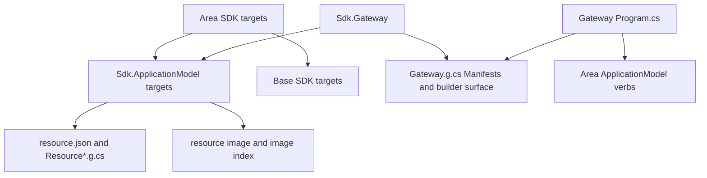

# Assimalign.Cohesion.Sdk.ApplicationModel Design

## Design intent

This SDK owns the build-time application model: resource defaults, manifest and
source generation, resource-reference lifting, certificate validation, image
production, image indexes, and the container-build extension hook. It is an
auxiliary SDK imported by an area SDK after the consumer project body has chosen
whether orchestration is enabled.

The build-time dependency and output flow is:


```mermaid
flowchart TD
    Area["Area SDK targets"] --> Model["Sdk.ApplicationModel targets"]
    Area --> Base["Base SDK targets"]
    Model --> Resource["resource.json and Resource*.g.cs"]
    Model --> Image["resource image and image index"]
    Gateway["Sdk.Gateway"] --> Model
    Gateway --> Surface["Gateway.g.cs Manifests and builder surface"]
    Program["Gateway Program.cs"] --> Surface
    Program --> Verbs["Area ApplicationModel verbs"]
```

Area SDKs import the ApplicationModel targets before the base targets. Gateway
always takes the same path. The gateway's hand-written `Program.cs` references
both the generated `Manifests` members and the area ApplicationModel verbs it
composes them with; no package contributes build items to that surface.

## Package and file boundary

The package contains:

- `Sdk/Sdk.props`, intentionally empty because the enable switch is written in
  the consumer project body and is not final during props evaluation;
- `Sdk/Sdk.targets`, which marks the import and establishes pre-.NET-target
  defaults;
- `Targets/Sdk.Resource.props` and `Sdk.Resource.targets`;
- `Targets/Sdk.Resource.Paths.targets`, evaluated after the .NET targets establish
  target-framework- and RID-specific intermediate paths;
- `Targets/Sdk.Image.targets`;
- `Targets/Assimalign.Cohesion.Sdk.ResourceManifest.props` and
  `RESOURCE_MANIFEST_README.md`;
- `Targets/Assimalign.Cohesion.Sdk.ApplicationModel.Build.targets`, the reserved
  aggregation point; and
- `Assimalign.Cohesion.Sdk.ApplicationModel.Tasks.dll`, containing the resource,
  manifest, certificate, and image tasks.

Strongly typed settings and pin validation remain in the base task assembly.

## MSBuild evaluation order

`CohesionApplicationModel` is normally assigned in the consumer's project body,
so the conditional SDK import can only be made from a layered SDK's
`Sdk.targets`. The import order is deliberately:

1. layered SDK `Sdk.props` imports the base props, which imports the packed and
   frozen `Targets/Build.Version.props`;
2. the consumer body assigns `CohesionApplicationModel` and declares items;
3. layered `Sdk.targets` conditionally imports this SDK with
   `Version="$(CohesionVersion)"`;
4. this SDK sets resource host defaults and imports the resource evaluation
   contract so reference items exist before conversion;
5. this SDK imports the base `Sdk.targets`, which imports
   `Microsoft.NET.Sdk.targets` and converts name-only references;
6. this SDK imports the late resource paths and image targets; the layered SDK's
   marker-guarded base import is skipped.

`SelfContained`, `RuntimeIdentifier`, and
`ValidateExecutableReferencesMatchSelfContained` must be set at step 4 because
Microsoft's targets consume them at step 6. `CohesionImageRuntimeIdentifier`
captures an explicit consumer RID before the host default is applied.

The split between steps 4 and 6 is load-bearing. Restore-visible
`CohesionPackageReference` and `CohesionProjectReference` items must exist before
the base converter, while paths based on `IntermediateOutputPath` must be captured
after Microsoft's targets establish the RID-specific value.

Moving `ItemDefinitionGroup` defaults into the targets phase is safe. MSBuild
evaluates all item definitions before it evaluates project items, even when the
definitions occur in a targets import after the consumer body. This preserves
defaults for `CohesionEndpoint`, `CohesionMount`, `CohesionSetting`,
`CohesionResourceReference`, and the other existing item contracts.

## Exact sibling version resolution

The shared SDK packaging target does not copy the repository's dynamic
`Build.Version.props`. At pack time it writes a static snapshot containing the
resolved `CohesionVersion` and places that file in each SDK nupkg. Therefore an
area SDK's target import resolves this package at the same package identity that
contains the importer: canonical packages use `10.0.0-preview.1` and local
packages use `10.0.0-preview.1.local`.

MSBuild supports property expansion in an SDK import's `Version` attribute. The
slash syntax (`Sdk="Name/$(Version)"`) is intentionally not used because MSBuild
does not expand it for this scenario. No new `global.json` pin is required.

## Resource generation contract

`CohesionCreateResourceManifest` validates an enabled executable, resolves
resource references, and writes deterministic manifest and C# outputs. Existing
public properties, items, targets, and generated member names are unchanged by
the package relocation. The generated identifier algorithm treats
non-alphanumeric characters as segment boundaries, preserves established
four-character application spelling such as `AppA`, substitutes `Value` for an
empty result, and prefixes a leading digit with `_`.

Disabled projects generate no manifest, resource API, control-plane registration,
or application-model diagnostic. The base guard handles the distinct error in
which a project says `enabled` but never imports this SDK.

`CohesionCommand` items become the manifest's deterministic `commands` array.
Names are trimmed, deduplicated ordinally, and sorted. The item accepts one
metadata, `RequiresInputResolver` (`true` or `false`, empty meaning `false`); a
kind declared more than once must carry the same value. An unflagged kind is
written as a string and a flagged one as
`{ "kind": "...", "requiresInputResolver": true }`, so a manifest that flags
nothing is unchanged. The flag tells a gateway that the resource accepts the
command only after an `IResourceCommandInputResolver` has rewritten its declared
payload; `Build()` fails when the declaring application registers no resolver
for the kind, while unflagged kinds are still delivered as declared.
`Sdk.SecretStore` flags `secretstore.add-secret`. The packed manifest's
`RESOURCE_MANIFEST_README.md` states the full contract. Command declaration and
execution remain runtime application-model concerns.

## Gateway composition contract

This SDK's contract with `Sdk.Gateway` is the manifest itself. Gateway reads each
referenced `resource.json` and generates a `Manifests.<Name>` member for it, plus
`Externals`, `Applications`, and `References` for boundary-crossing and gateway
references. It generates no per-resource verb. Composition is hand-written in
the gateway's `Program.cs`:

```csharp
using Assimalign.Cohesion.ApplicationModel;

IApplicationBuilder builder = Gateway.CreateBuilder(args);
builder.AddWeb(Manifests.OrdersApi, new WebResourceOptions { Replicas = 2 });
builder.AddResource(Manifests.OrdersWorker);
```

The typed verbs are ordinary `extension(IApplicationBuilder)` members that ship in
each area's ApplicationModel package. Each takes a `ResourceManifest` and an
optional instance of the area's options and returns a descriptor: the area's typed
descriptor, carrying its command verbs, where the area defines one. `IApplicationBuilder.AddResource(ResourceManifest)`
is the generic verb for a kind with no ApplicationModel in reach. A third-party
ApplicationModel package extends the builder the same way, so extending gateway
composition needs neither a change to `Sdk.Gateway` nor an MSBuild item
contribution. Calling a verb whose ApplicationModel package the gateway does not
reference is an ordinary compile error.

In-process bindings do not depend on the verb. `Gateway.CreateBuilder(args)`
registers each binding by manifest identity, so a resource added through any verb
over `Manifests.<Name>` is colocated.

This replaces an open `CohesionGatewayResourceKind` item contract (resource kind,
ApplicationModel identity, options type, descriptor type, and static add method)
from which Gateway generated one typed `Add<Name>()` verb per resource, falling
back to an untyped verb with warning COHGW003 when the named ApplicationModel
package was not referenced. The item, its first-party rows, the generated verbs,
and COHGW003 were withdrawn together. The first-party rows named resource-area
types from inside `sdks/`, which libraries and SDKs may not depend on, and a
hand-written call is checked by the compiler instead of by a build warning. The
manifest's `applicationModel` field remains descriptive metadata; Gateway derives
no package reference or verb from it.

## Container image production

`CohesionPublishImage` is the single-resource entry point and runs through
`CohesionBuildResourceContainersDependsOn`. The default image RID is
`linux-x64`; `linux-arm64`, `linux-musl-x64`, and `linux-musl-arm64` map to the
corresponding OCI platform and base-image family. A nested publish receives one
consistent vector for RID, self-containment, and AOT.

`CohesionImageAot=auto|true|false` preserves the existing capability policy.
Release does not silently fall back from required NativeAOT. The resource image
index records a digest-pinned repository, platform, AOT decision, base image,
and an archive only when the archive remains contained by the index location.
The gateway gather verifies archives and writes `application.images.json`.

`Assimalign.Cohesion.Sdk.ApplicationModel.Build.targets` remains the stable
extension point. Platform packages append target names to
`CohesionBuildResourceContainersDependsOn`; they do not import a file from the
base SDK by path.

## Visual Studio MSBuild compatibility

All shipped props and targets must evaluate under Visual Studio's .NET Framework
MSBuild as well as `dotnet msbuild`. They avoid runtime APIs unavailable to that
host. A dedicated compatibility test loads the packed ApplicationModel SDK and
runs restore with the Visual Studio MSBuild selected by `vswhere`.

## Diagnostics

| Code | Severity | Contract |
| --- | --- | --- |
| COHSDK001 | Error | A resource reference targets a project with `CohesionApplicationModel` disabled. |
| COHSDK003 | Error | NativeAOT image production has no usable host or in-container route. |
| COHSDK004 | Warning or error | A packed resource lacks a required digest-pinned image. |
| COHSDK005 | Error | A framework-dependent container base lacks Cohesion shared frameworks. |
| COHSDK008 | Error | An enabled application model requires executable output. |
| COHSDK009 | Error | Resource-property keys must use the current kind's prefix. |
| COHSDK010 | Error | Certificate metadata violates the HTTPS/Secret-mount contract. |

COHSDK002 and COHSDK011 remain base-SDK diagnostics.

## Extending and testing

To add a third-party area SDK, set `_CohesionResourceSdk=true` before importing
the base props, add App plus App.<Area> under the shared auto-include condition,
set area defaults in the area's props, and use the exact conditional and
marker-guarded targets imports shown in the overview. App supplies Connections
once for the generated resource accessors and every area hosting module; do not
duplicate Connections in App.<Area>.
To give gateways a typed verb for a new area, ship an `extension(IApplicationBuilder)`
verb over `ResourceManifest` in the area's ApplicationModel package; neither this
SDK nor `Sdk.Gateway` changes.

Acceptance tests consume packed SDKs from `_out/packages` so the tests cover
NuGet SDK resolution and the package boundary rather than only source-tree
imports. The same fixtures cover clean regeneration, design-time evaluation,
manifest packing, certificate rules, and image behavior.

## Non-goals

This SDK does not own general project defaults, strongly typed settings, SDK pin
validation, framework registration, or name-only project references. It also
does not choose a platform implementation; platform providers remain package
contributions consumed by Gateway. It defines no gateway resource-kind table and
generates no composition verbs: gateway composition is hand-written against the
area ApplicationModel packages.
