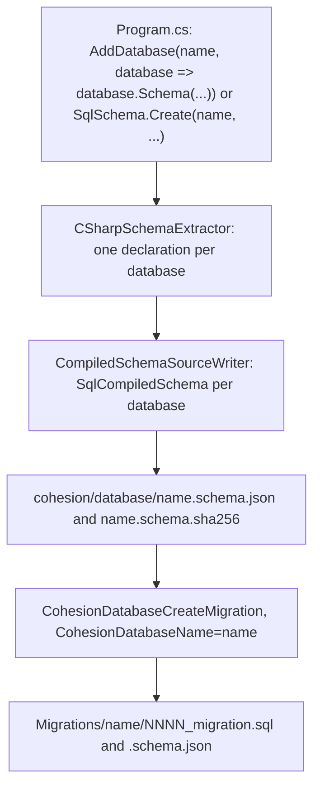

# Database SDK Design

## Boundaries

A database's C# schema declaration is the only schema source. The SDK compiler reads Roslyn
syntax and symbols from `@(Compile)` and `@(ReferencePath)`; it never invokes `Program.Main`,
starts an engine, loads a consumer plug-in, or scans `Schema/**/*.sql`. The compiler lowers each
declaration into the SQL family's `SqlCompiledSchema` contract and uses the schema's own canonical
document and hash, so build, migration and provisioning artifacts share one contract.

Two anchors declare a database's schema, one declaration per database (B1 of
`docs/programs/DATABASE_ENGINE_EXTENSIBILITY_DESIGN.md`, §5.7; owner decision 59 of 2026-10-09):

| Anchor | The database it declares |
| --- | --- |
| `SqlDatabaseBuilder.Schema(Action<SqlSchemaBuilder> declare)` | The constant first argument of the `SqlDatabaseEngineBuilder.AddDatabase(name, configure)` whose callback parameter receives the call. |
| `SqlSchema.Create(name, configure)` or `SqlSchema.Compile(name, configure)` | Its constant `name`. A `SqlSchema` value reaches an engine through `AddDatabase(SqlSchema)` or `database.Schema(SqlSchema)`, neither of which is a second anchor. |

The runtime's `database.Schema(declare)` is `SqlSchema.Create(<database name>, declare)`, so both
anchors compile to the document the engine's build provisions and records.

The extractor recognizes the declaration DSL by metadata name: the two anchors, then calls on the
sealed `SqlSchemaBuilder`, `SqlTableBuilder<TRow>` (``SqlTableBuilder`1``), `SqlTypeBuilder` and
`SqlPrincipalBuilder` (`CSharpSchemaExtractor.cs`). Those strings change in the same commit as the
types they name: a stale one compiles and then rejects every schema at build time. The task
project references only `Database.Sql.Schema`, so `SqlDatabaseBuilder` and
`SqlDatabaseEngineBuilder` are names it matches in the consumer's compilation, never symbols it
links against. The test project compiles its consumer sources against the real `Database.Sql`
assembly, so renaming either builder fails the SDK tests in the same change.

The C# function, trigger and extension declarations, their extraction and the expression
canonicalizer that turned their lambdas into canonical C# text are gone (owner decision 57 of
2026-10-09): nothing ever executed them. Engine functions are registered on the SQL engine
builder, and SQL-defined functions arrive through DDL.

The SDK is a build-time layer. Its tasks may run under the JIT-based MSBuild host and reference
the AOT-compatible `Database.Sql.Schema` package, but the task and Roslyn assemblies never enter the
consumer's runtime closure. The task references only `Database.Sql.Schema` (the `COHLIB001`
same-area precedent); it does not pull the SQL engine, its storage implementation, or
`Connections.Tcp` into MSBuild.

## Orchestration commands

When `CohesionApplicationModel=enabled`, the `Assimalign.Cohesion.Sdk.ApplicationModel`
manifest task writes this SDK's `CohesionCommand` defaults, `database.add-database` and
`database.add-principal`, as bare strings in `commands`; neither sets `RequiresInputResolver`,
the metadata that switches an entry to the object form. These advertise the Database
default control plane's bounded command set. Typed declarations ship in
Database.ApplicationModel, and the gateway delivers them through its generic
`ResourceControlPlaneCommandClient`; the SDK never executes them or places payloads in
the manifest. The schema compiler and migration path remain independent.

## Model selection

`CohesionDatabaseModel` is an exact selector. The shared targets file contains explicit,
allowlisted imports:

- `Sql` imports `Sdk.Database.Sql.targets`.
- `KeyValuePair` imports `Sdk.Database.KeyValuePair.targets`.

Each imported file sets `_CohesionDatabaseModelTargetsLoaded` and registers one private compile
target through `_CohesionDatabaseModelCompileTarget`. An absent selector fails with
`COHDBSDK001`; an incomplete model file fails with `COHDBSDK002`. Explicit imports are deliberate:
a project property can never expand into an arbitrary import path.

## Build contract

`CohesionDatabaseCompileSchema` runs after references resolve and before `CoreCompile` when
`CohesionDatabaseProject=true`. Model targets pass the same C# inputs to
`CompileDatabaseSchemaTask` with their fixed model identity. SQL supplies the compiled-schema
contract; KeyValuePair compilation fails with `COHDBSDK106` until that model owns a schema
package. The diagram shows the path from the C# to the artifacts and a migration.

The task accepts only statically analyzable schema declarations: names and numeric configuration
are compile-time constants, selectors are direct members, schema callbacks are inline lambdas,
and a `database.Schema(...)` call is made on the `AddDatabase` callback's own parameter (a helper
method that receives the `SqlDatabaseBuilder` works at run time but fails here; declare a reusable
schema as a `SqlSchema.Create(name, ...)` value instead). Artifacts are keyed by database name
alone, so a database name is unique across every engine of the project, although two engines may
each own a database of one name at run time. A schema principal or custom type fails the build
(`COHDBSDK108`): every SQL engine build refuses it before touching a file (`COHSQLP001`, owner
decision 58), so an artifact for it would only move the failure to the first start. Every
declaration is compiled before any artifact is written, so a failure replaces none. The
diagnostics:

| Code | Meaning |
| --- | --- |
| `COHDBSDK100` | A source or reference could not be read, or the language version is unknown. |
| `COHDBSDK101` | No schema declaration was found, or a database name (compared ignoring case, across every engine of the project) has more than one. |
| `COHDBSDK102` | A name is not a non-empty constant; a `database.Schema(...)` call has no constant enclosing `AddDatabase` name; or a database name cannot name a file. |
| `COHDBSDK103` | A schema, table, type or principal callback is not an inline lambda. |
| `COHDBSDK104` | An operation the DSL does not support. |
| `COHDBSDK105` | A duplicate table, type, principal, column, index or primary key. |
| `COHDBSDK106` | A semantic error: a dangling or mistyped reference, a column whose CLR type is not a SQL column type (the message lists the supported types), the KeyValuePair model, or a compiled-schema validation error (prefixed with the database name). |
| `COHDBSDK108` | `SqlSchemaBuilder.Principal` or `SqlSchemaBuilder.Type<T>`: a declaration every SQL engine build refuses (`COHSQLP001`) until principal, grant and custom-type DDL exists. |

The outputs are:

| Name | Default | Meaning |
| --- | --- | --- |
| `CohesionDatabaseSchemaOutputDirectory` | `$(IntermediateOutputPath)cohesion/database/` | Holds `<database>.schema.json`, the canonical `SqlCompiledSchema` JSON, and `<database>.schema.sha256`, the lowercase SHA-256 of its exact UTF-8 bytes, for every declared database. |
| `schemas.manifest` | In the output directory | The databases whose artifacts the task wrote, one name per line. |
| `CohesionDatabaseSchema` items | Set by `CohesionDatabaseCompileSchema` | One per database the manifest lists (its schema document, full path), with `DatabaseName` and `HashPath` metadata, for downstream targets. |
| `Schemas` task output | `CompileDatabaseSchemaTask` | One item per database, named for it, with `Hash`, `SchemaPath` and `HashPath` metadata. |

The document contains semantic data only, never source paths or timestamps. The task writes with
LF line endings and avoids replacing unchanged outputs. The manifest is the only record of which
files in the directory are the SDK's: the task deletes the `.schema.json` and `.schema.sha256`
files of a database its previous manifest listed and that is no longer declared, and leaves every
other file alone, so a consumer's own `*.schema.json` in an overridden directory is neither deleted
nor read as a database. The manifest is written on every successful compile and is the model
target's incremental output. Editing C# or a reference assembly, deleting the directory, or
pointing `CohesionDatabaseSchemaOutputDirectory` somewhere new invalidates it; and
`_CohesionDatabaseCheckSchemaArtifacts`, which runs before the model target, deletes the manifest
when an artifact it lists is gone, so a hand-deleted artifact is written again instead of the build
reading a partial set. The artifacts and the manifest are `FileWrites`, and `Clean` removes them.

## Migrations

`CohesionDatabaseCreateMigration` first compiles the desired schemas, then works on one database,
named by `CohesionDatabaseName` (compared ignoring case), which a project that declares exactly one
database may omit. Without it in a project that declares more, the target fails with
`COHDBSDK207`, and with a name the manifest does not list with `COHDBSDK203`; both list the
declared databases. Each database numbers its own migrations in `$(CohesionDatabaseMigrationsRoot)/<database>/`
(default `Migrations/<database>/`), so two databases never share an ordinal sequence or a file
name. A required, sanitized `CohesionDatabaseMigrationName` is combined with the next four-digit
ordinal. SQL compares the new document with the database's newest `NNNN_name.schema.json`
baseline through the shared `SqlSchemaMigrationPlanner`, renders operations in planner order, and
atomically emits matching `NNNN_name.sql` and `NNNN_name.schema.json` files. There are no
timestamps. Missing names, invalid schemas, unsupported/destructive operations, and path
collisions fail without partial outputs. `KeyValuePair` fails explicitly because a SQL script is
not a valid migration artifact for that model. SQL text uses the same guarded, `dbo`-qualified
dialect as the runtime renderer; the current dialect explicitly rejects constraints, custom types,
ALTER metadata, and required column additions that have no default or backfill.

## Verification

SDK-local tests evaluate the real target imports for SQL and KeyValuePair, the artifact directory
and manifest defaults, the manifest as the model target's output and the artifact check ahead of
it, the migration target's parameters, and the fallback diagnostic for unknown/case-mismatched
selectors. Task tests cover static/runtime canonical JSON and hash parity for both anchors, one
artifact per database and the manifest, removal of an undeclared database's artifacts while a
foreign `*.schema.json` stays, the hosted `AddSql` shape, the unanalyzable-name and file-name
refusals, duplicate and missing declarations, the principal and custom-type refusals
(`COHDBSDK108`), invalid C# schema diagnostics, per-database SQL migration numbering, the
one-database default and dialect output, and the KeyValuePair compilation and migration errors. The SampleHost end-to-end test in
`Database.Testing` checks the remaining link: the SDK's hash equals the hash the running host
recorded when its engine build provisioned the database. Packaging remains governed by the
repository's SDK pack contract; Microsoft.Build host assemblies are excluded from the shipped task
dependency closure.
