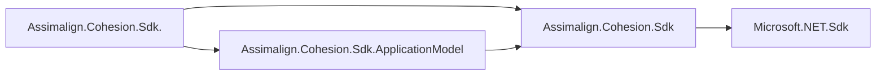

# Assimalign.Cohesion.Sdk Design

## Design intent

The base SDK is the Cohesion equivalent of `Microsoft.NET.Sdk`: a general build
foundation for plain libraries and executables. It owns defaults, framework
registrations, strongly typed settings, name-only project references, and pin
validation. It deliberately does not own resource manifests, generated resource
surfaces, image production, or orchestration.

The split keeps the base package useful without introducing resource semantics:

The arrows show import dependencies. Area SDKs import the ApplicationModel SDK
only for enabled consumers, except Gateway, which always imports it. The
ApplicationModel SDK relies on version and common properties established by the
base props path but does not import the base targets a second time.

## Project defaults and evaluation

`Targets/Assimalign.Cohesion.Sdk.Defaults.props` is imported before
`Microsoft.NET.Sdk` props. A direct base-SDK consumer therefore receives the
Microsoft default `OutputType=Library`. Each resource-area SDK sets the private
`_CohesionResourceSdk` marker before importing the base props, which lets that
same file set `OutputType=Exe` before Microsoft defaults it; a consumer assignment
in the project body still wins. Target-framework, language, nullable, implicit-
using, and AOT defaults remain general base-SDK policy. The base also keeps
`CohesionApplicationModel=disabled` in common props, making the switch visible
to every area SDK without adding application-model behavior.

The base target order is:

1. set `DisableTransitiveFrameworkReferenceDownloads` when empty;
2. import `Microsoft.NET.Sdk/Sdk.targets`;
3. import pin validation, strongly typed settings, and name-only reference
   targets;
4. run the COHSDK011 boundary guard before build preparation or compilation.

Self-contained and runtime-identifier defaults for enabled resources moved to
the ApplicationModel SDK because they exist for image and orchestration builds.
That SDK must be imported by a layered SDK before the layered SDK imports the
base targets; its design documents the ordering constraint.

## Strongly typed settings contract

`CohesionAppSettingsClass` is the sole opt-in and supplies the generated root
class name. `CohesionAppSettingsNamespace` overrides the default
`RootNamespace`. Without the class property, the target collects no inputs and
adds no generated source.

The generator merges `appsettings*.json` in ordinal-ignore-case path order.
Null values do not erase known types, integer/floating-point overlays widen to
`double`, and incompatible shapes fail the build. Generated binding uses
explicit `IConfiguration.GetEntry` calls; it does not use reflection, dynamic
activation, or `ConfigurationBinder`. Missing values preserve property
initializers. The target fingerprints the class, namespace, inputs, and task
assembly and places outputs under the target-framework intermediate directory.

## Name-only references

`CohesionProjectReference` lets repository builds name a project and carry its
resolved path separately. The base target turns resolvable items into ordinary
MSBuild project references without exposing resource-specific metadata. Resource
reference collection and manifest lifting live in the ApplicationModel SDK.

## SDK pin agreement

The base validation task finds the nearest `global.json`. Every present,
recognized `Assimalign.Cohesion.Sdk*` entry is compared with ordinal string
equality; absence is allowed. The base pin is the anchor when present, otherwise
the first recognized identity in ordinal order is the anchor. This validates
agreement rather than imposing the repository's canonical version, so the local
identity is supported.

`Assimalign.Cohesion.Sdk.ApplicationModel` is a recognized identity if a consumer
chooses to pin it, but first-party area imports supply an exact `Version`
attribute and require no additional pin.

## Application-model guard

The ApplicationModel SDK sets the private marker
`_CohesionApplicationModelSdkImported=true`. Before `PrepareForBuild` and
`CoreCompile`, the base SDK reports COHSDK011 when
`CohesionApplicationModel=enabled` and the marker is absent. The diagnostic
names both supported remedies: choose a resource-area SDK or import the sibling
SDK explicitly after the enabling property.

The marker is intentionally private. Existing public MSBuild properties and
items retain their names in the ApplicationModel package; the relocation adds no
public CLR interface members and no `InternalsVisibleTo` relationship.

## Framework boundary

The base registers every `KnownFrameworkReference` but auto-includes none. It is
a library SDK like `Microsoft.NET.Sdk`; a direct executable names App explicitly.
Each resource-area SDK adds App plus App.<Area> under one
`CohesionAutoIncludeAppFramework` condition. Gateway remains NuGet-only unless
in-process composition adds App and the referenced areas. App itself is the
transitive Assimalign project-reference closure of the hosting-kernel roots in
`frameworks/Assimalign.Cohesion.App.props`, plus its umbrella assembly. Connections
is a kernel root because generated resource accessors and every area hosting module
depend on it. Other libraries are consumed as ordinary packages.

## Diagnostics

| Code | Severity | Contract |
| --- | --- | --- |
| COHSDK002 | Error | All present recognized Cohesion SDK pins agree exactly and the pinned .NET SDK is valid and at least `10.0.300`. |
| COHSDK011 | Error | Enabling the application model requires an imported ApplicationModel SDK. |

Package-boundary tests restore SDKs from `_out/packages`, exercise SDK resolution,
and compile consumer fixtures. Visual Studio compatibility tests load shipped
props and targets with .NET Framework MSBuild to reject APIs unavailable in that
host.

## Non-goals

The base SDK does not create resource manifests, generated resource or control-
plane source, image indexes, OCI archives, or application image gathers. Those
belong to `Assimalign.Cohesion.Sdk.ApplicationModel`; Gateway adds composition on
top of that package.
